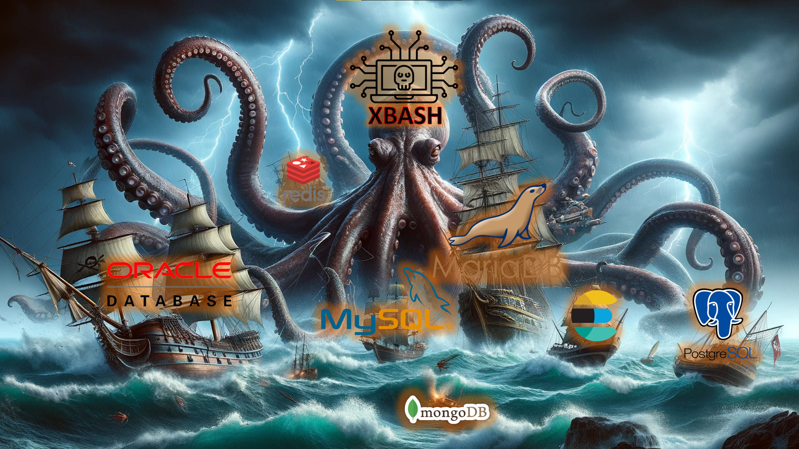

# Simulation of the Database Wiper and Ransom Component of the Xbash Malware

  

This repository builds upon the insights presented in the technical article [The Database Slayer: Deep Dive and Simulation of the Xbash Malware](https://www.trustwave.com/en-us/resources/blogs/spiderlabs-blog/the-database-slayer-deep-dive-and-simulation-of-the-xbash-malware/). While the original article offered a comprehensive analysis, it focused only on databases aligned with our organization's product offerings. This repository was created to extend that research, offering a broader platform for further experimentation and deeper exploration of Xbash malware’s behavior across additional database environments.

## Overview

**Xbash** is a multifaceted malware combining ransomware, botnet capabilities, cryptomining, and self-propagation. Discovered in 2018, it targets databases such as MySQL, MariaDB, PostgreSQL, MongoDB, Redis, Elasticsearch, OracleDB, and many more databases leading to data destruction.

## Features

- **Partial Simulation**: Replicates Xbash's database ransomware attack in a controlled environment.
- **Comprehensive Resources**: Includes code, configuration files, and insights for hands-on analysis.

## Getting Started

### Prerequisites

- **Docker**: Ensure Docker is installed on your system. [Download Docker](https://www.docker.com/get-started)
- **Python 3.x**: Required for running simulation scripts. [Download Python](https://www.python.org/downloads/)

### Installation

1. **Clone the Repository**:

   ```bash
   git clone https://github.com/yourusername/xbash-simulation.git
   cd xbash-simulation
   ```

2. **Set Up the Environment**:

   - **Virtual Environment (Optional but Recommended)**:

     ```bash
     python3 -m venv venv
     source venv/bin/activate  # On Windows, use 'venv\Scripts\activate'
     ```

   - **Install Required Python Packages**:

     ```bash
     pip install -r requirements.txt
     ```

4. **Build and Run Docker Containers**:

   - Start the containers:

     ```bash
     sudo docker-compose up -d
     ```

## Simulation Sequence

1. **Verify Database and Data Setup**:

     ```bash
     python fetch_data.py
     ```

2. **Execute the Xbash Database Wiper and Ransomware Simulation Script**:

     ```bash
     python xbash_simulation.py
     ```

3. **Analyze Xbash Execution Aftermath**:

     ```bash
     python xbash_aftermath.py
     ```

## Important Notes

- **Controlled Environment**: This simulation is intended for educational and research purposes only. Ensure you run it in a controlled, isolated environment to prevent unintended consequences.
- **Legal Compliance**: Always adhere to legal and ethical guidelines when conducting malware simulations.

## License

This project is licensed under the [MIT License](LICENSE).

---

*Disclaimer*: This simulation is for educational purposes only. The authors are not responsible for any misuse or damages resulting from its use.
